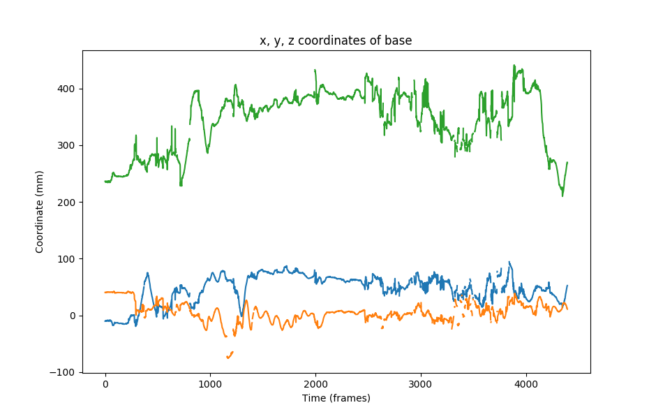
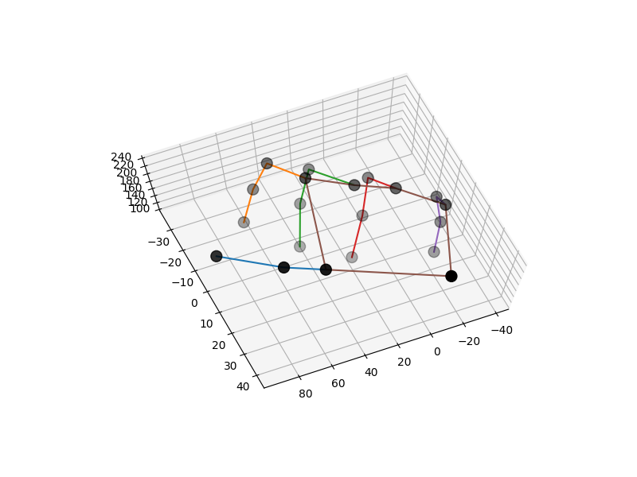

Aniposelib Tutorial
###################

`Aniposelib <https://github.com/lambdaloop/aniposelib>`_ is a Python
library for calibrating cameras and triangulation. Anipose uses
aniposelib for the ``anipose calibrate`` and ``anipose triangulate``,
but there may be instances in which you have a DeepLabCut project and only 
want to use perform calibration, triangulation, and (optionally) 
apply 3D filters. This is a tutorial on how to use aniposelib for those who 
already have a DeepLabCut project.

In this tutorial, we will walk through a Python script that uses aniposelib to 
calibrate three cameras and triangulate the 2D detections. We will be starting from  
a DLC project folder that contains a model to track 20 keypoints on a hand, 
the same dataset that was used in the :doc:`Anipose Tutorial </tutorial>`.

Setup
-----

If you would like to follow along as we walk through the Python code, then 
you may begin by downloading the following: 

- The calibration and triangulation materials for the hand dataset found in this
  `Google Drive folder <https://drive.google.com/drive/folders/1ItnZrtuELjWg1XZtu3VdJfEOBTYKJ-sH?usp=sharing>`_.
  You are welcome to use any of these files as a reference at any point.

  - The Jupyter Notebook, ``aniposelib example.ipynb``, and the Python script, 
    ``aniposelib_minimal_example.py``, contain the code that we will discuss in 
    this tutorial. You may use either of these to follow along by running 
    the code locally.

  - The three ``.MOV`` files contain the calibration videos. We used a ChArUco board 
    to calibrate the cameras, though you also have the option of using a checkerboard.

  - The three ``.h5`` files are from the DLC project. They encode the the most 
    likely *x* and *y* coordinates of each keypoint on the ChArUco board. These 
    files will be used in triangulation.

  - Optional: The aniposelib calibration file, ``calibration.toml``, contains
    properties of the cameras, as well as the estimated parameter values for
    the camera extrinsics and intrinsics. 

Installation
------------

We will be importing modules from aniposelib, so you will need to have 
aniposelib installed on your machine. You can install the latest 
version from pip with:

.. code-block:: text

   pip install aniposelib

After the installation is complete, we can start the Python script by importing
the necessary modules from ``aniposelib``. More information about the 
``aniposelib.cameras`` and ``aniposelib.boards`` modules can be found in 
the :doc:`aniposelib API reference </aniposelib-api>`.

.. code-block:: python

    import numpy as np
    from aniposelib.boards import CharucoBoard, Checkerboard
    from aniposelib.cameras import Camera, CameraGroup
    from aniposelib.utils import load_pose2d_fnames

Calibration
-----------

The following code sets some variables regarding information about the
cameras and board used for calibration. The videos in ``vidnames`` correspond 
to the path names of the calibration videos for each of the three 
cameras used in calibration. The variable ``cam_names`` contains the names
of the three cameras, and ``n_cams`` stores the number of cameras. 

A ChArUco board was used for the calibration (this can be seen in any of
the three calibration videos), so a ChArUco board object is constructed 
with parameters regarding information about the markers:

- ``X = 7`` and ``Y = 10`` because there are 7 squares in the vertical direction
  and 10 squares in the borizontal direction on the calibration board. 
- ``square_length = 25`` indicate that the dimensions of each square on the board 
  is 25 mm. 
- ``marker_length = 18.75`` indicates that the dimensions of each marker within 
  each square is 18.75 mm. 
- ``marker_bits = 4`` describes the dimension of the markers, so each marker
  consists of 4x4 bits.
- ``dict_size = 50`` specifies that there are 50 types of markers in the marker
  dictionary. 

When using aniposelib to calibrate your cameras, if you used a checkerboard
for calibration, then you would construct a checkerboard object instead. 
More information about the 
`ChArUco board <https://anipose.readthedocs.io/en/latest/aniposelib-api.html#aniposelib.boards.CharucoBoard>`_
and `checkerboard <https://anipose.readthedocs.io/en/latest/aniposelib-api.html#aniposelib.boards.Checkerboard>`_
objects can be found in the aniposelib API. 

Lastly, ``cgroup`` is an object used to refer to all of the cameras as
a single unit. When given the names of the cameras, ``CameraGroup.from_names()``
forms a CameraGroup object of the corresponding cameras. We
set ``fisheye = true`` because the videos from this dataset were 
recorded using fisheye lens, but ``fisheye = false`` by default.

.. code-block:: python

    vidnames = [['calib-charuco-camA-compressed.MOV'],
                ['calib-charuco-camB-compressed.MOV'],
                ['calib-charuco-camC-compressed.MOV']]
    
    cam_names = ['A', 'B', 'C']
    
    n_cams = len(vidnames)
    
    board = CharucoBoard(7, 10,
                         square_length=25, # here, in mm but any unit works
                         marker_length=18.75,
                         marker_bits=4, dict_size=50)
    
    
    # the videos provided are fisheye, so we need the fisheye option
    cgroup = CameraGroup.from_names(cam_names, fisheye=True)
    
Next, we will use the function ``calibrate_videos()`` to detect the ChArUco 
boards in each of the videos and calibrate the cameras accordingly. This 
function takes as parameters a list of lists of video filenames (one list
per camera) and a calibration board object, which specifies what should
be detected in the videos. Iterative bundle adjustment 
is used to calibrate the cameras by minimizing the reprojection
error. At each iteration, this method defines a threshold for the reprojection 
error, then performs bundle adjustment on the points for which the 
reprojection error is below the determined threshold. 

The code for this step will take about 15 minutes to run. Alternatively, if 
you don't want to wait for the detections to be determined, you can download
the ``calibration.toml`` provided in this
`Google Drive folder <https://drive.google.com/drive/u/1/folders/1Y4qzeL80mXOvDAJpbAsnQQLXeoBcvtK0>`_
that was discussed in `Setup`_.  If you choose to 
do this, you can proceed to the next step, where you are shown how to load
``calibration.toml``. 

.. code-block:: python

    # this will take about 15 minutes (mostly due to detection)
    # it will detect the charuco board in the videos,
    # then calibrate the cameras based on the detections, using iterative bundle adjustment
    cgroup.calibrate_videos(vidnames, board)
    
    # if you need to save and load
    # example saving and loading for later
    cgroup.dump('calibration.toml')

If you saved ``calibration.toml`` to load for later or used the provided,
``calibration.toml`` file, it can be loaded with the following line of code.  

.. code-block:: python

    ## example of loading calibration from a file
    ## you can also load the provided file if you don't want to wait 15 minutes
    cgroup = CameraGroup.load('calibration.toml')
    
Triangulation
-------------

During triangulation, aniposelib provides you with the option to apply 3D filters.
The code shown below is an example of triangulation without filtering. First,
the ``.h5`` files are loaded with ``load_pose2d_fnames()``, which takes a 
dictionary that maps the camera names to the corresponding ``.h5`` files 
and a list of the camera names contained in the camera group. These 
``.h5`` files encode the the most likely 2D coordinates of each keypoint 
that we tracked on the hand. All of the 2D points with a score
below ``score_threshold`` are removed, as they are considered erroneous. 

The function ``triangulate()`` then determined the 3D coordinates of the hand 
given the 2D coordinates from all of the cameras. The reprojection error 
is then computed with ``reprojection_error()`` given the 2D coordinates 
associated with each keypoint from each camera and the 3D coordinates determined
from all of the cameras. The reprojection error describes how well
the 2D projections of a triangulated 3D point match its corresponding
2D keypoints in every camera view. Further information about the functions for  
`triangulation <https://anipose.readthedocs.io/en/latest/aniposelib-api.html#aniposelib.cameras.CameraGroup.triangulate>`_ and 
`reprojection error <https://anipose.readthedocs.io/en/latest/aniposelib-api.html#aniposelib.cameras.CameraGroup.reprojection_error>`_ can be found in the API.

.. code-block:: python

    ## example triangulation without filtering, should take < 15 seconds
    fname_dict = {
        'A': '2019-08-02-vid01-camA.h5',
        'B': '2019-08-02-vid01-camB.h5',
        'C': '2019-08-02-vid01-camC.h5',
    }
    
    d = load_pose2d_fnames(fname_dict, cam_names=cgroup.get_names())
    
    score_threshold = 0.5
    
    n_cams, n_points, n_joints, _ = d['points'].shape
    points = d['points']
    scores = d['scores']
    
    bodyparts = d['bodyparts']
    
    # remove points that are below threshold
    points[scores < score_threshold] = np.nan
    
    points_flat = points.reshape(n_cams, -1, 2)
    scores_flat = scores.reshape(n_cams, -1)
    
    p3ds_flat = cgroup.triangulate(points_flat, progress=True)
    reprojerr_flat = cgroup.reprojection_error(p3ds_flat, points_flat, mean=True)
    
    p3ds = p3ds_flat.reshape(n_points, n_joints, 3)
    reprojerr = reprojerr_flat.reshape(n_points, n_joints)

Visualization 
-------------

Now that we have 3D points from triangulation, we can visualize
our data! We will first provide an example of how to use the 
output from triangulation to plot the positions of a given joint
across time. The code shown below extracts and plots the *x*, *y*, and
*z* positions of joint 0, which corresponds to the base of the hand 
(see Figure 1).

.. code-block:: python

    # plot the x, y, z coordinates of joint 0
    
    import matplotlib.pyplot as plt
    % matplotlib notebook
    
    plt.figure(figsize=(9.4, 6))
    plt.plot(p3ds[:, 0, 0])
    plt.plot(p3ds[:, 0, 1])
    plt.plot(p3ds[:, 0, 2])
    plt.xlabel("Time (frames)")
    plt.ylabel("Coordinate (mm)")
    plt.title("x, y, z coordinates of {}".format(bodyparts[0]))

   Figure 1. The *x*, *y*, and *z* coordinates of the joint corresponding
   to the base of the hand across all of the frames. 

Additionally, we can visualize the position of the hand at each frame 
by plotting the 3D position of all of the tracked hand joints. The following
code plots the 3D position of the hand determined from the the first frame 
in the three videos. The ``scheme`` defines which keypoints are connected in 
the hand, so it serves as a nice visual aid. The 3D positions of 
the hand are shown in Figure 2.

.. code-block:: python

    ## plot the first frame in 3D
    from mpl_toolkits.mplot3d import Axes3D
    from matplotlib.pyplot import get_cmap
    %matplotlib notebook
    
    def connect(ax, points, bps, bp_dict, color):
        ixs = [bp_dict[bp] for bp in bps]
        return ax.plot(points[ixs, 0], points[ixs, 1], points[ixs, 2], color=color)
    
    def connect_all(ax, points, scheme, bodyparts, cmap=None):
        if cmap is None:
            cmap = get_cmap('tab10')
        bp_dict = dict(zip(bodyparts, range(len(bodyparts))))
        lines = []
        for i, bps in enumerate(scheme):
            line = connect(ax, points, bps, bp_dict, color=cmap(i)[:3])
            lines.append(line)
        return lines
    
    ## scheme for the hand
    scheme = [
       ["MCP1", "PIP1", "tip1"],
       ["MCP2", "PIP2", "DIP2", "tip2"],
       ["MCP3", "PIP3", "DIP3", "tip3"],
       ["MCP4", "PIP4", "DIP4", "tip4"],
       ["MCP5", "PIP5", "DIP5", "tip5"],
       ["base", "MCP1", "MCP2", "MCP3", "MCP4", "MCP5", "base"]
     ]
    
    framenum = 0
    p3d = p3ds[framenum]
    
    fig = plt.figure(figsize=(8, 6))
    ax = fig.add_subplot(111, projection='3d')
    ax.scatter(p3d[:,0], p3d[:,1], p3d[:,2], c='black', s=100)
    connect_all(ax, p3d, scheme, bodyparts)
    

   Figure 2. 3D positions of the hand joints in the first frame. 
   These positions were determined through triangulation.
