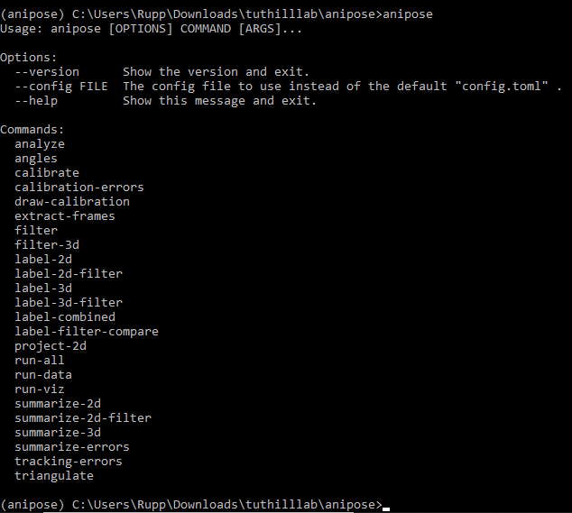

Installation
############

Anipose can be installed with the steps described below, starting with installing 
Python 3. If you already have Python 3 installed through the Anaconda distribution,
you can begin the installation process at `Set up a virtual environment with Anipose`_. 

Install Python 3 via Anaconda
==============================
 
1. We recommend installing Python 3 through the Anaconda distribution.
   You can download the installer for your machine `here <https://www.anaconda.com/products/individual#macos>`_.
   The `installation pages <https://docs.anaconda.com/anaconda/install/>`_ in the Anaconda
   documentation have screenshots that are helpful if you would like further guidence 
   during the installation process.

2. After you have installed Anaconda, open the Anaconda Prompt (for Windows) or the
   terminal (for Linux and macOS) and enter 

   .. code-block:: text

      conda list

   to make sure the installation was successful. If Anaconda is installed, this will output 
   a list of installed packages and their versions. Enter ``python`` to launch a Python
   shell. The version information will be displayed, and it should include “Anaconda”. 
   Exit the Python shell with ``quit()``.

Set up a virtual environment with Anipose
==========================================

1. From the Anaconda Prompt (for Windows) or the terminal (for Linux and macOS), create
   a conda environment with Python 3.7 and Tensorflow. Activate the environment, then 
   install DeepLabCut with ``pip``. To do this, you can run the following commands:  

   .. code-block:: text

      conda create -n yourenvname python=3.7 tensorflow=1.13.1
      conda activate yourenvname
      python -m pip install deeplabcut

2. Next, install ``wxPython`` with ``pip``. For Windows and MacOS, run 

   .. code-block:: text

      python -m pip install -U wxPython

   For Linux, you need the specific wheel. See the 
   `wxPython documentation <https://wxpython.org/pages/downloads/index.html>`_
   for more details. 

3. Install Anipose with pip with the following command:
  
   .. code-block:: text

       python -m pip install anipose

4. Install ``ffmpeg`` and ``mayavi`` in your conda environment with the commands shown below. 
   Note that you will have to upgrade ``apptools`` after installing ``mayavi`` with ``conda``. 

   .. code-block:: text

       conda install mayavi ffmpeg
       pip install --upgrade apptools

Check if Anipose was installed 
===============================

1. You can check if Anipose was installed by typing 

   .. code-block:: text

      anipose

  in the Anaconda Prompt or the terminal. If the installation was successful, you should see a list
  of commands that can be run with Anipose. The expected output is shown below. 

Now you are all set to use Anipose!
