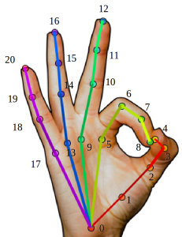
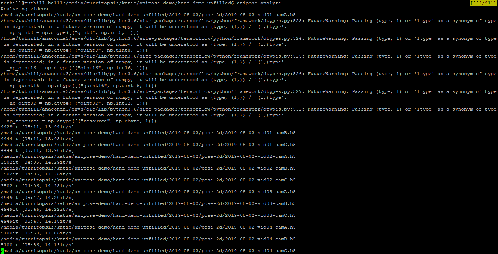
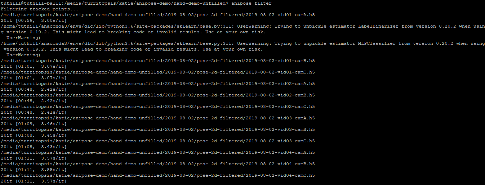
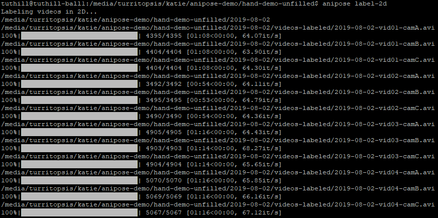
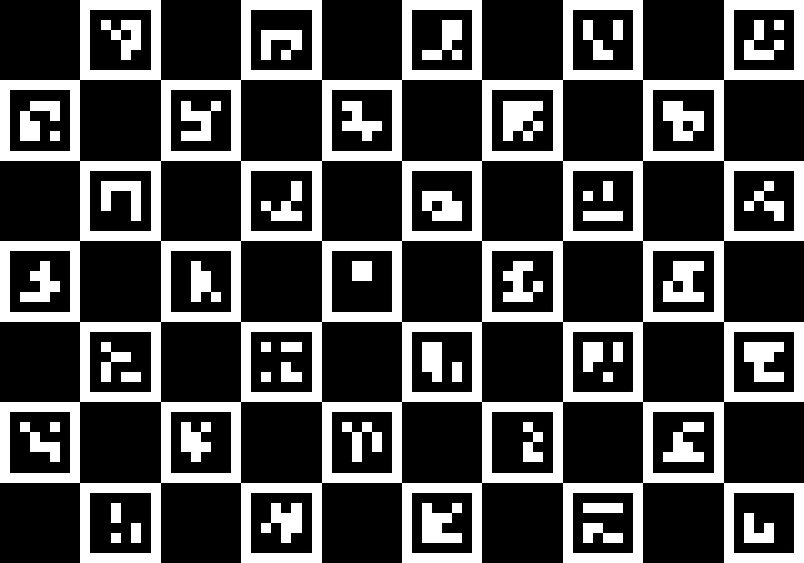
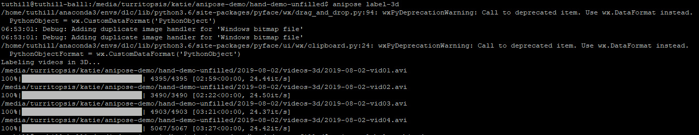
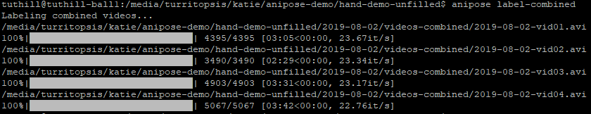
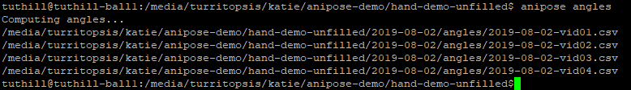
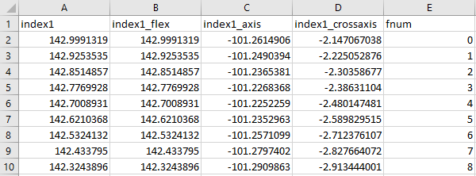

Anipose Tutorial
################

Welcome! This is a tutorial that will help familiarize you with the workflow of Anipose.

Setting Up the Project
======================

We have prepared a dataset to help you learn how to use Anipose. In this demo, 
we will be using Anipose to track the positions of 21 different keypoints on the 
hand (see Figure 1). Begin by downloading ``hand-demo-dlc-TuthillLab-2019-08-05``
and ``hand-demo-unfilled`` from
`here <https://drive.google.com/drive/u/1/folders/18qGbHyiSJ2au9sFXScZ63EZ83PtC1-ld>`_. 
The DeepLabCut project folder contains a 
pre-trained DLC network, and the hand demo folder is the Anipose project folder. 
Then do the following:

- In the DLC project folder, change the ``project_path`` variable in the ``config.yaml`` 
  file to the path where the the DLC project folder is located on your machine 
- In the folder containing the hand demo videos, change the ``model_folder`` variable in
  ``config.toml`` to the path where the DLC project folder is located on your machine. 
  This path should match the path in the ``project_path`` variable from above. 

   Figure 1. Schematic of a hand depicting the location of all 21 keypoints that we 
   will be tracking in this demo.

Understanding Configuration Parameters
======================================
There are parameters in the Anipose ``config.toml`` file that are pertain to 
project setup, camera calibration, filtering data, triangulation, and 
angle calculation. When analyzing your own data, these parameters can be
changed according your objectives and preferences, so it is important
to understand what each parameter does. Some of the relevant parameters 
are discussed in this tutorial, but if you would like a more general reference,
:doc:`Anipose Configuration File Parameters </params>` contains a description of 
all of the parameters in ``config.toml``. 

Analyzing the Data
==================
Navigate to the ``hand-demo-unfilled`` folder and run the following command from the
command line:

.. code-block:: text

   anipose analyze

If you received an error instead of the output shown above, you may have forgotten 
to change the path variables in ``config.yaml`` and ``config.toml``. If this is 
the case, please see `Setting Up the Project`_ to ensure that you are specifying 
the project paths correctly. 

Filtering the Data
==================

The following command will apply a Viterbi filter to the predicted keypoints: 

.. code-block:: text

   anipose filter

The filter applied over the 2D data functions as a threshold filter.
Predicted labels that do not fall within the threshold are removed
and replaced with a new prediction that is determined by interpolating.
In ``config.toml``, the parameter ``spline`` can be set to ``true`` for 
interpolation using a cubic spline, or ``false`` for linear interpolation.

In ``hand-demo-unfilled/2019-08-02``, you will see that a new folder named
``pose-2d-filtered`` has been created. This folder contains h5 files that 
encode the the most likely x- and y-coordinates of each keypoint after 
filtering the 2D data. 

Generating 2D Labels
====================
Next, to plot the predicted 2D labels on each frame, run 

.. code-block:: text

   anipose label-2d

This will create a folder in ``hand-demo-unfilled/2019-08-02`` called ``videos-labeled`` 
that contains a labeled version for each of the videos that were initially in the 
Anipose project folder.

Feel free to navigate to this folder and watch a couple of the videos. For example, 
you should find that the labeled video generated for ``2019-08-02-vid01-camA.avi`` 
looks like this: 

.. figure:: anipose-tutorial/videos-labeled.gif
   :align: center

Calibrating the Cameras
=======================
Before labeling the videos in 3D, the cameras have to be calibrated. The command

.. code-block:: text

   anipose calibrate

Performs camera calibration of intrinsics and extrinsics. The folder calibration in
``hand-demo-unfilled/2019-08-02`` will be updated to include the camera parameters
obtained from 3D calibration. The calibration videos were initially in this folder.

Note that the cameras can be calibrated with ArUco, ChArUco, or checkerboards. The
relevant parameters in config.toml for this step relate to the board used for 
calibration. For this demo, the videos were calibrated with a ChArUco board, as shown
in Figure 2. In ``config.toml``, ``board_size`` specifies the dimensions of the board used 
for calibration, ``square_side_length`` specifies the length of the squares in the
board, and ``board_marker_length`` specifies the size of the marker within each square.
In the ``config.toml`` file, we set ``fisheye = true`` because our videos were taken with
cameras that have fisheye lenses. When running Anipose on your own data, these 
parameters will need to be set according to your calibration.

   Figure 2. Schematic of the ChArUco board used for camera calibration.

Triangulating Data
==================

Now, let’s triangulate the data with the following command: 

.. code-block:: text

   anipose triangulate

.. figure:: anipose-tutorial/triangulate_screenshot_c.png
   :align: center

When running Anipose triangulate, you will see output for each group of videos that
looks like the output shown above. It contains information about the optimization
of the cost function.

For each group of videos (videos that were taken at the same time, but from different
cameras), there will be a csv file generated in ``hand-demo-unfilled/2019-08-02/pose-3d``
containing information about the triangulation. 

In ``config.toml``, smoothing and spatial constraints can be specified for triangulation. 
The constraints parameter contains all of the pairs of keypoints that you wish to impose
constraints between. The ``scale_smooth`` and ``scale_length`` parameters specify the 
extent to which smoothing and spatial constraints are enforced, respectively. These 
constraints help reduce tracking errors.

By default, the ``anipose label-3d`` command alsocapplies filters to the 3D data, similar 
to the ``anipose filter`` command used to apply 2D filters. The parameter ``optim`` in the
Anipose ``config.toml`` file specifies whether the 3D filters are applied. If you do
not want to apply 3D filters, you may replace ``optim = true`` with ``optim = false``
in the ``config.toml`` file. 

When ``optim = true``, the 3D filters can be configured by specifying parameter values
in ``config.toml``. The ``score_threshold`` parameter specifies the score below which
a label is considered erroneous. The filter functions in removing these points, as 
they are likely errors in tracking, and interpolates instead. 

Generating 3D Labels
====================

Now that the data have been triangulated, we can plot the predicted labels from the
3D tracking for each group of videos. To do this, run the following command:

.. code-block:: text

   anipose label-3d

This step will generate videos of the 3D tracking in ``hand-demo-unfilled/2019-08-02/videos-3d``.
The resulting video from ``hand-demo-unfilled/2019-08-02/videos-3d/2019-08-02-vid01.avi``
is shown below. 

.. figure:: anipose-tutorial/videos-3d.gif
   :align: center 

Generating Combined Videos
==========================

To concatenate the videos for each group of videos obtained from running ``anipose label-2d``
and ``anipose label-3d``, run  

.. code-block:: text

   anipose label-combined

The combined videos will be contained in ``hand-demo-unfilled/2019-08-02/videos-combined``.
Four combined videos are created by following this tutorial. Here is the combined video from
``hand-demo-unfilled/2019-08-02/videos-combined/2019-08-02-vid01.avi``.

.. figure:: anipose-tutorial/combined-videos.gif
   :align: center

When using ``anipose label-combined``, the videos concatenated in the top panel correspond
to those generated from ``anipose label-2d``. Each panel contains the labeled video from
a different camera view, so the number of panels corresponds to the number of cameras 
used. The 3D model generated from ``anipose label-3d`` is displayed on the bottom half 
of the combined video.

Computing Angles 
================

In the ``config.toml`` file, variables can be specified under ``[angles]`` to tell Anipose
to compute the angles between three given keypoints. These angles are computed in degrees,
ranging from -180 to 180. With these angles in the ``config.toml`` file, 

.. code:: yaml

   [angles]
   index_1 = ["MCP2", "PIP2", "DIP2"]
   index_2 = ["PIP2", "DIP2", "tip2"]
   middle_1 = ["MCP3", "PIP3", "DIP3"]
   middle_2 = ["PIP3", "DIP3", "tip3"]
   ring_1 = ["MCP4", "PIP4", "DIP4"]
   ring_2 = ["PIP4", "DIP4", "tip4"]

we can run

.. code-block:: text

   anipose angles

as shown above to generate an angles folder in ``hand-demo-unfilled/2019-08-02``. Within
``hand-demo-unfilled/2019-08-02/angles``, there will be a csv file containing the 
specified angles for each of the groups of videos. Each column in the csv file corresponds
to an angle, and the rightmost column contains the frame number. 

The names of the angles that appear in the column header of the csv file correspond to 
what you named the variable with the corresponding keypoints in ``config.toml``. For instance,
the ``index_1`` variable specifies the keypoints required to calculate one of the 
angles between three of the keypoints that were tracked on the index finger, and the 
``ring_1`` variable specifies the keypoints required to calculate one of the angles
between three keypoints that were tracked on the ring finger. The first few lines of
``2019-08-02-vid01.csv`` are shown below. 

.. figure:: anipose-tutorial/angle_output.PNG
   :align: center

Different Rotations
-------------------

There is also the option to compute the angle for one of three types of rotations associated
with the three keypoints. This can be done by specifying the string ``'flex'``, ``'axis'``, 
or ``'cross-axis'`` as the first element in the list of angles. The following three 
elements in the list are still the three keypoints. The types of rotations 
associated with these arguments are as follows: 

- ``'flex'`` : flexion-extension angle between the three keypoints
- ``'axis'`` : angle of rotation of the vector associated with the second
  and third keypoints around the axis specified by the first and second keypoints 
- ``'cross-axis'`` : angle of rotation of the vector associated with the
  second and third keypoints around the axis perpendicular to both vectors
  associated with the three keypoints

The following code block shows an example of how to compute the three rotations
associated with the same three keypoints. Note that if no rotation type is specified
like the example shown above, the default rotation type is ``'flex'`` . Thus,
``index1`` and ``index1_flex`` shown below are equivelant.

.. code:: yaml

   [angles]
   index1 = ["MCP2", "PIP2", "DIP2"]
   index1_flex = ["flex", "MCP2", "PIP2", "DIP2"]
   index1_axis = ["axis", "MCP2", "PIP2", "DIP2"]
   index1_crossaxis = ["cross-axis", "MCP2", "PIP2", "DIP2"]

Here are the first few lines of ``2019-08-02-vid01.csv`` after running 
``anipose angles`` with the angle variables shown above: 

Automating the Process
======================
All of the steps that we walked through above can be classified either as data acquisition
or data visualization. If you are only interested in obtaining the data generated by 
Anipose, you can run 

.. code-block:: text

   anipose run-data

which is equivalent to running the following sequence of commands from above: 

.. code-block:: text

   anipose analyze
   anipose filter 
   anipose calibrate 
   anipose triangulate
   anipose angles

Similarly, the command 

.. code-block:: text

   anipose run-viz

runs only the Anipose commands regarding data visualization:

.. code-block:: text

   anipose label-2d
   anipose label-3d
   anipose label-combined

In the future, if you don’t want to run the steps of Anipose individually,
you can execute them with a single command: 

.. code-block:: text

   anipose run-all 

Which is equivalent to running ``anipose run-data``, followed by ``anipose run-viz``.

Additional Notes
================

If you would like to run a command that you have already executed, you will have to delete
or rename the folder that was originally generated by that command. If you don't, Anipose
will assume that this step has already been completed and will not update the existing files. 

